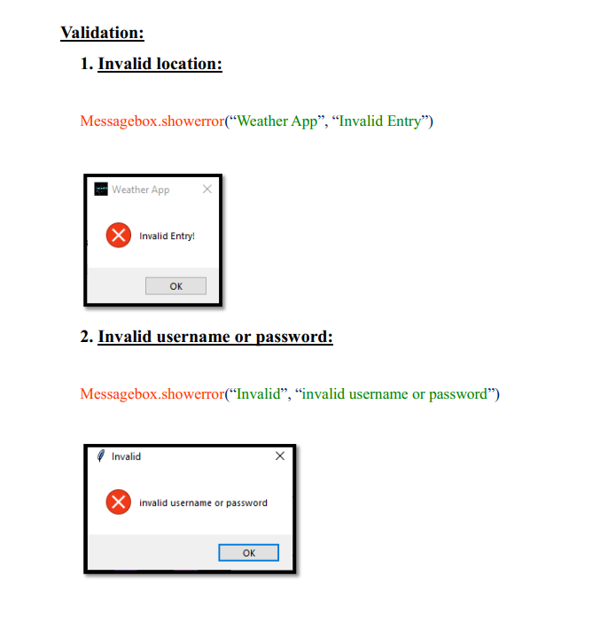
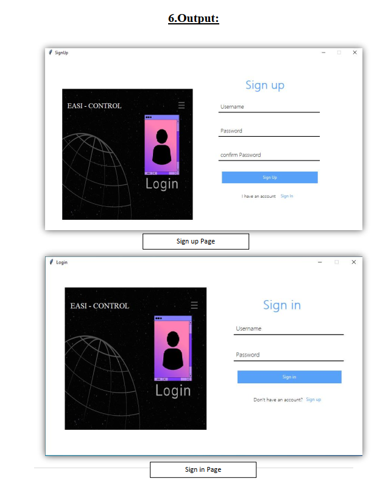
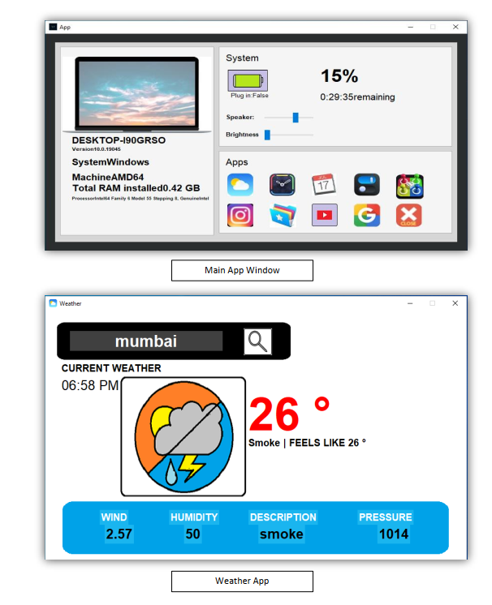
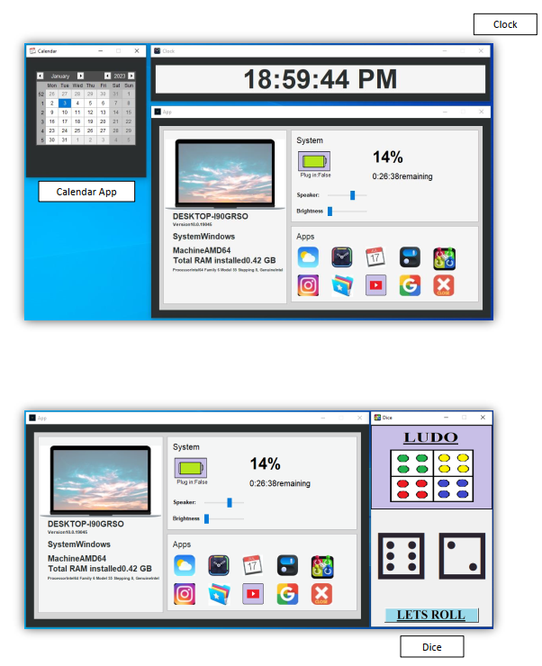
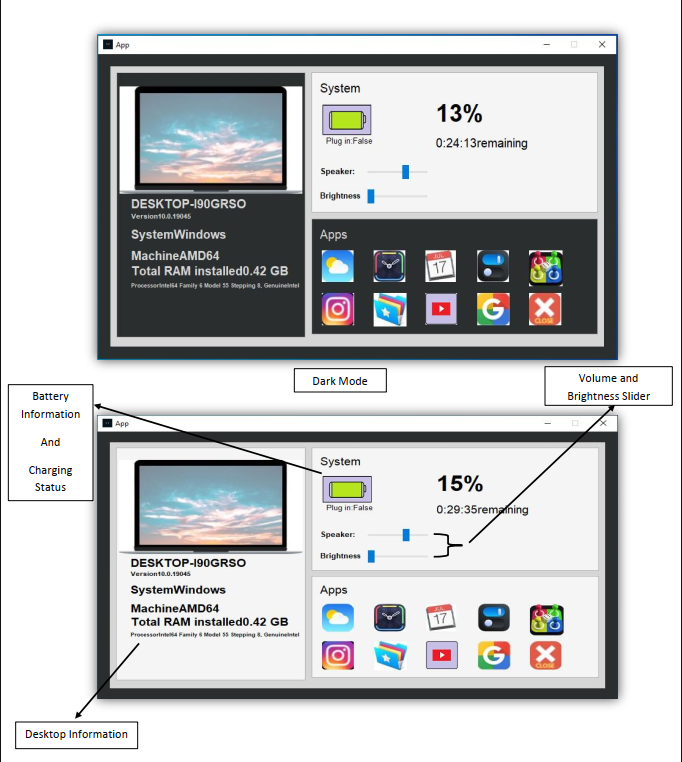

# easiControl


EasiControl is an innovative software application designed to enhance productivity and simplify device management. It features nine essential applications, complemented by various desktop functions, making it a one-stop solution for accessing all your apps, system functions, desktop status, and games. The user-friendly interface, characterized by a fresh and modern UI, ensures an intuitive experience for users of all skill levels. EasiControl leverages powerful libraries to provide a rich set of functionalities: it utilizes tkinter for a responsive graphical interface and psutil to monitor system performance. The application incorporates screen brightness control through screen_brightness_control, audio management using pycaw, and location-based services with geopy and timezonefinder. Additionally, it features a dynamic clock that displays the current time and date, and a calendar for scheduling. Users can easily open websites via webbrowser and automate tasks using pyautogui. With the ability to fetch weather information through API requests and manage audio settings, EasiControl stands out as a comprehensive tool for enhancing your digital experience.
## Run Locally


Clone the project

```bash
  git clone https://github.com/viraj-ap/easiControl.git
```

and pip install all the libraries used.
## Screenshots








